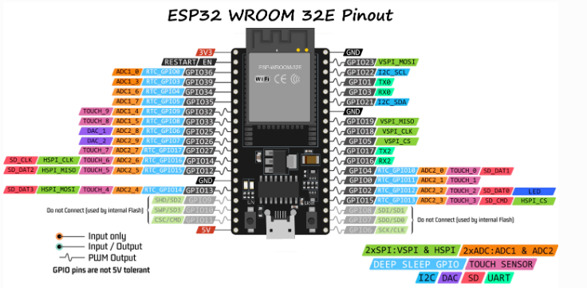
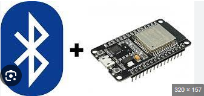

# TemasESP32
Trabajos ESP32
## 💡Datasheet

1. [Código 1] (https://github.com/JAlfredo420/TemasESP32/blob/426665693af721d404ebfcd5a59d8706531082ae/ESP32GIT/Codigos/BT1.ino)
* * Este código permite que los datos enviados desde un puerto serie (por ejemplo, desde un monitor serial en una computadora) se transmitan a través de Bluetooth a otro dispositivo, y viceversa. De esta manera, puedes interactuar con un dispositivo Bluetooth como si fuera un puerto serie tradicional.

2. [Código 2:](https://github.com/JAlfredo420/TemasESP32/blob/426665693af721d404ebfcd5a59d8706531082ae/ESP32GIT/Codigos/BT2.ino)
*  Este código permite controlar un LED conectado al ESP32 a través de Bluetooth. Utiliza el puerto serie Bluetooth para recibir comandos (1 o 0) y encender o apagar el LED en el pin 2. Cuando recibe un "1" (en formato ASCII), enciende el LED, y cuando recibe un "0", lo apaga. Además, envía mensajes de confirmación al dispositivo Bluetooth.

3. [Código 3](https://github.com/JAlfredo420/TemasESP32/blob/426665693af721d404ebfcd5a59d8706531082ae/ESP32GIT/Codigos/BT3.ino)
* Este código permite controlar un LED conectado al ESP32 mediante comandos Bluetooth. Al recibir "1" (ASCII), enciende el LED; al recibir "0", lo apaga, y envía un mensaje de confirmación al dispositivo Bluetooth.

4. [Código 4](https://github.com/JAlfredo420/TemasESP32/blob/426665693af721d404ebfcd5a59d8706531082ae/ESP32GIT/Codigos/BT4.ino)
* Este código permite controlar dos LEDs conectados al ESP32 mediante Bluetooth.

5. [Código 5](https://github.com/JAlfredo420/TemasESP32/blob/426665693af721d404ebfcd5a59d8706531082ae/ESP32GIT/Codigos/BT5.ino)
* Este código permite controlar un LED conectado al pin 2 de un ESP32 a través de Bluetooth. El ESP32 recibe comandos por Bluetooth para encender o apagar el LED.

6. [Código 6](https://github.com/JAlfredo420/TemasESP32/blob/426665693af721d404ebfcd5a59d8706531082ae/ESP32GIT/Codigos/ESP_Direcciones_Mac.ino)
*Este código configura el ESP32 para usar ESP-NOW y muestra en el monitor serie las direcciones MAC de la estación (STA) y del punto de acceso (AP).
7. [Código 7](https://github.com/JAlfredo420/TemasESP32/blob/426665693af721d404ebfcd5a59d8706531082ae/ESP32GIT/Codigos/TimerWakeUp_Dormir.ino)
* Este código configura el ESP32 para entrar en modo de deep sleep (modo de bajo consumo) y despertar automáticamente después de un tiempo definido (10 segundos en este caso). Durante el deep sleep, la mayoría de los componentes del ESP32 se apagan para ahorrar energía.
8. [Código 8](https://github.com/JAlfredo420/TemasESP32/blob/426665693af721d404ebfcd5a59d8706531082ae/ESP32GIT/Codigos/Esclavo_EspNow.ino)
* Este código utiliza ESP-NOW para enviar datos desde un ESP32 a otro. Se configura el dispositivo para enviar una estructura con diferentes tipos de datos (texto, número, flotante, etc.) cada 2 segundos y se muestra el estado del envío en el monitor serie.
  9. [Código 9](https://github.com/JAlfredo420/TemasESP32/blob/426665693af721d404ebfcd5a59d8706531082ae/ESP32GIT/Codigos/Esclavo_EspNow.ino)
* Este código permite a un ESP32 receptor recibir una estructura de datos a través de ESP-NOW, imprimir los valores recibidos en el monitor serie

 
